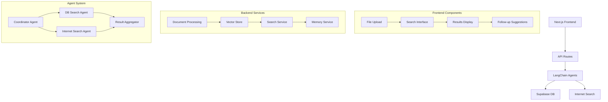
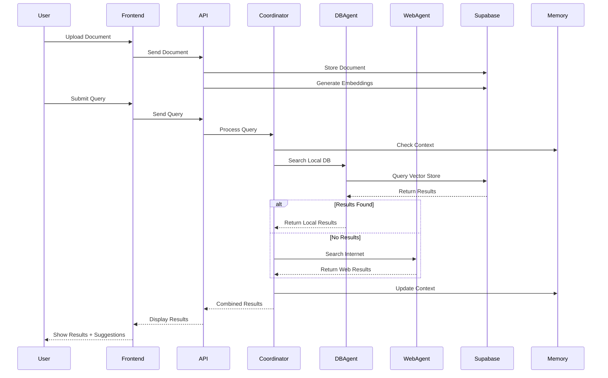
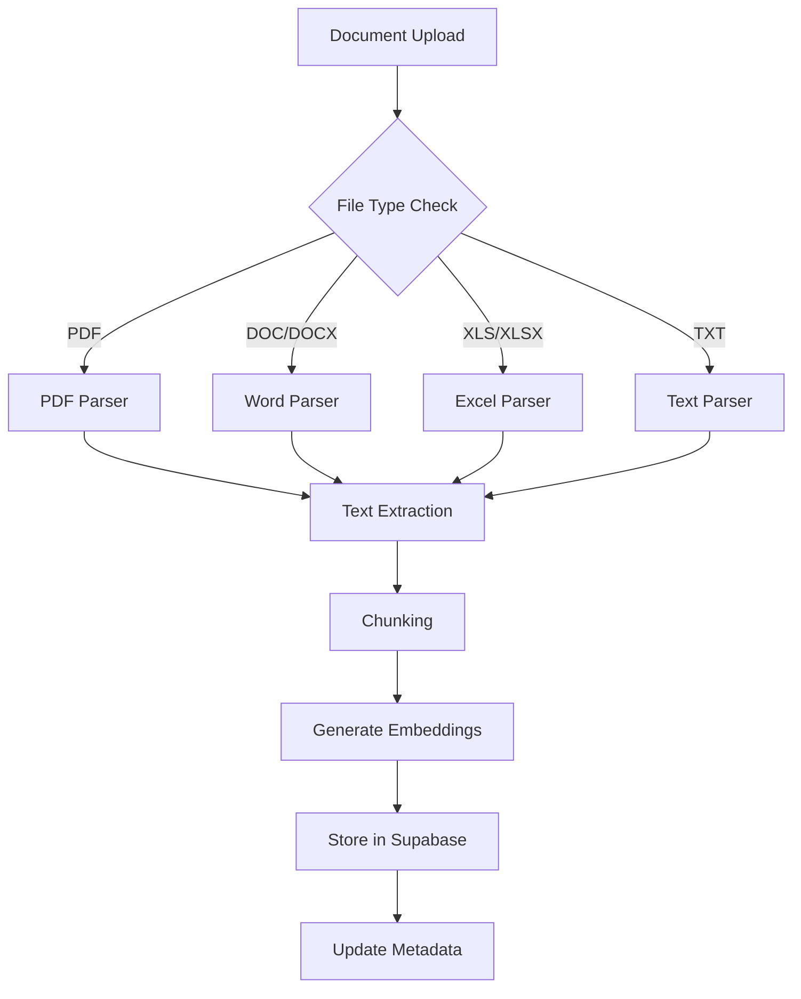
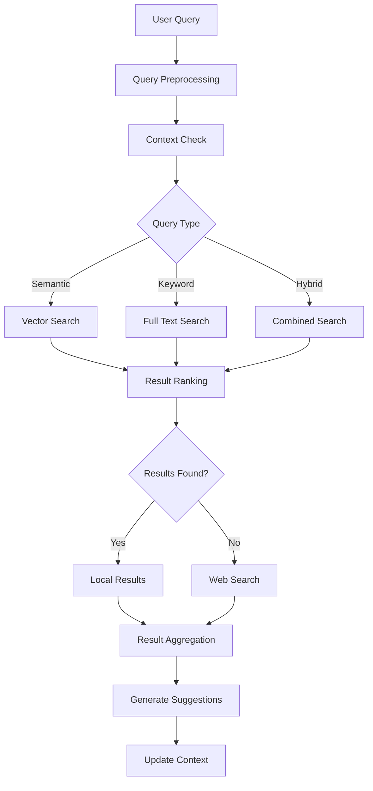
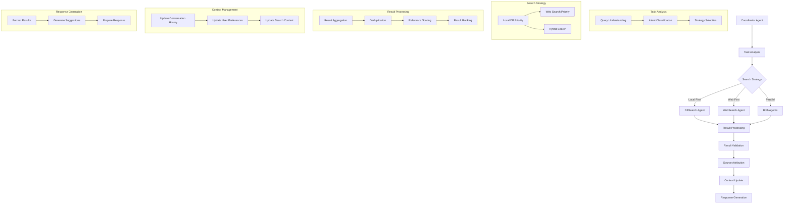
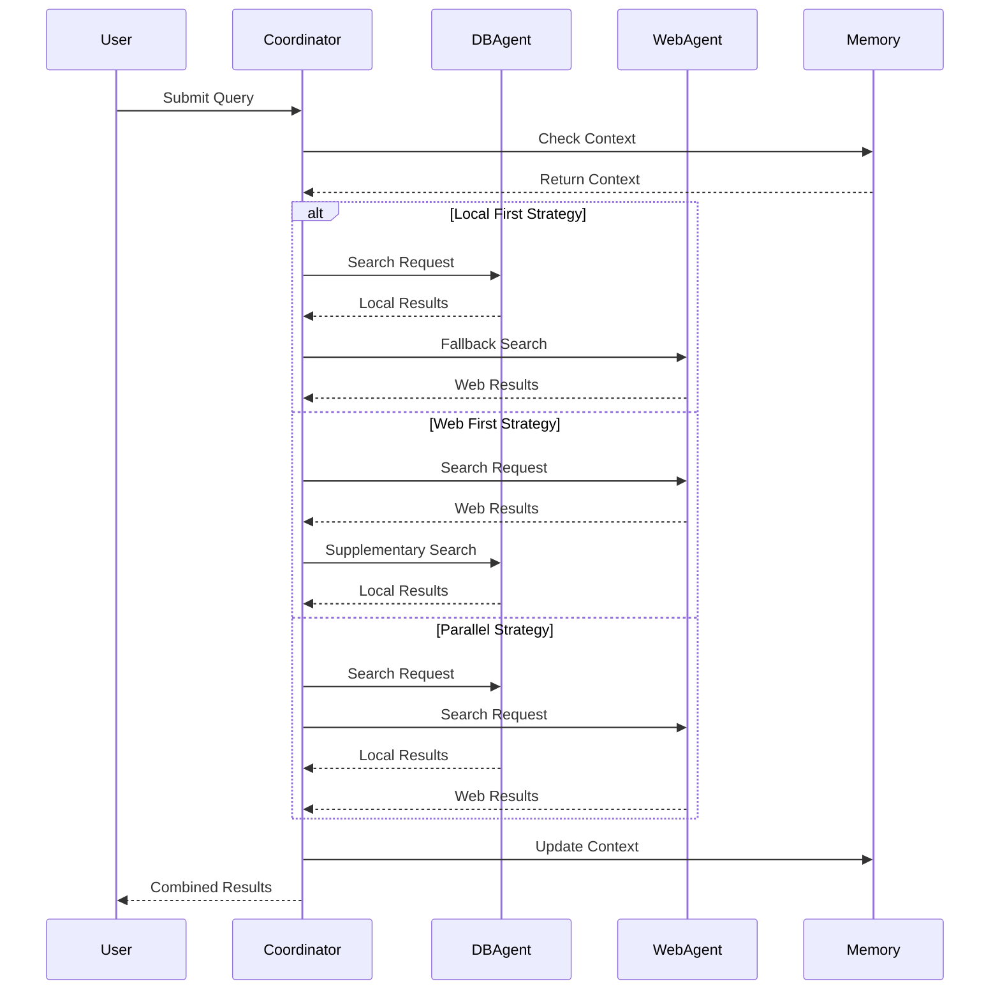
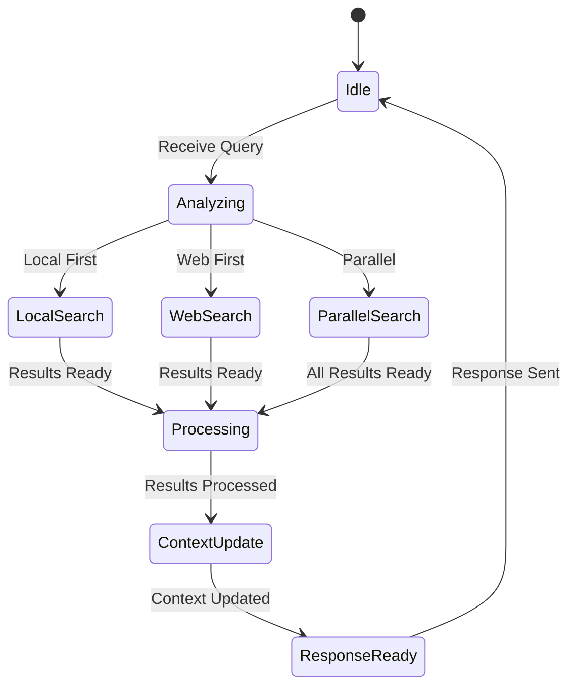
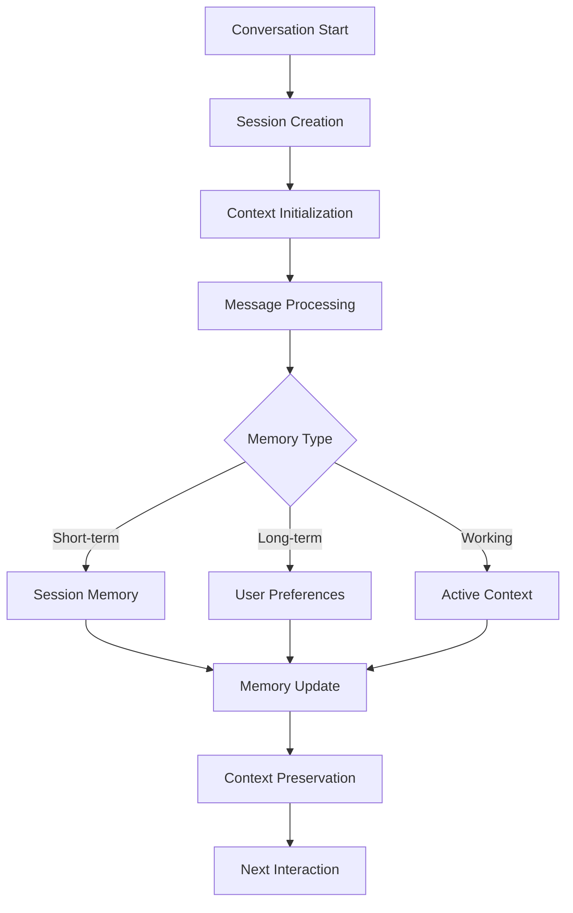
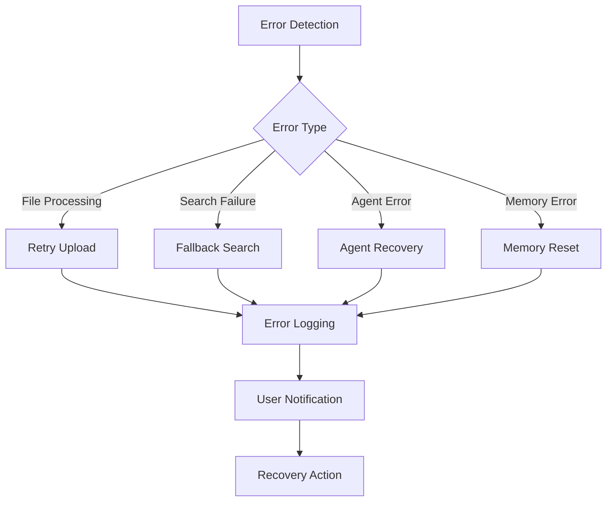
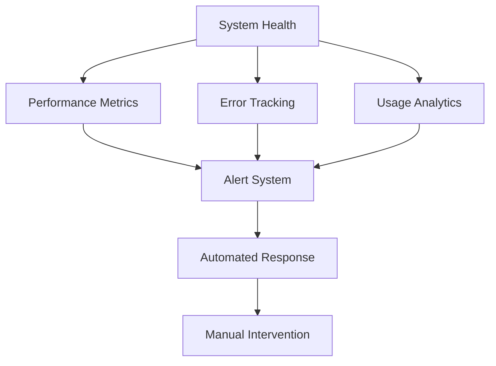

# Document Search System Implementation Plan

## System Architecture



## Detailed Flow Diagram



## Technical Implementation Details

### 1. Frontend (Next.js)

```typescript
// app/types/index.ts
interface SearchState {
  query: string;
  results: SearchResult[];
  suggestions: string[];
  context: ConversationContext;
}

// components/ui/file-upload.tsx
interface FileUploadProps {
  onUpload: (file: File) => Promise<void>;
  supportedFormats: string[];
  className?: string; // For Tailwind CSS classes
}

// components/ui/search-interface.tsx
interface SearchInterfaceProps {
  onSearch: (query: string) => Promise<void>;
  context: ConversationContext;
  className?: string; // For Tailwind CSS classes
}

// components/ui/results-display.tsx
interface ResultsDisplayProps {
  results: SearchResult[];
  sources: Source[];
  suggestions: string[];
  className?: string; // For Tailwind CSS classes
}

// Example component implementation with shadcn/ui
import { Button } from "@/components/ui/button";
import { Input } from "@/components/ui/input";
import { Card } from "@/components/ui/card";
import { cn } from "@/lib/utils";

// components/ui/search-interface.tsx
export function SearchInterface({ onSearch, context, className }: SearchInterfaceProps) {
  return (
    <div className={cn("w-full max-w-2xl mx-auto", className)}>
      <form onSubmit={handleSubmit} className="space-y-4">
        <Input
          type="text"
          placeholder="Enter your search query..."
          className="w-full"
        />
        <Button type="submit" className="w-full">
          Search
        </Button>
      </form>
    </div>
  );
}
```

### 2. Backend (API Routes)

```typescript
// pages/api/upload.ts
export default async function handler(req: NextApiRequest, res: NextApiResponse) {
  const { file } = req.body;
  // Process file and store in Supabase
}

// pages/api/search.ts
export default async function handler(req: NextApiRequest, res: NextApiResponse) {
  const { query, context } = req.body;
  // Coordinate search between agents
}

// pages/api/chat.ts
export default async function handler(req: NextApiRequest, res: NextApiResponse) {
  const { message, history } = req.body;
  // Handle conversation memory and context
}
```

### 3. LangChain Agents

```typescript
// agents/CoordinatorAgent.ts
class CoordinatorAgent {
  private dbAgent: DBSearchAgent;
  private webAgent: WebSearchAgent;
  private memory: ConversationMemory;

  async coordinateSearch(query: string): Promise<SearchResult> {
    // Coordinate between agents
  }
}

// agents/DBSearchAgent.ts
class DBSearchAgent {
  private vectorStore: SupabaseVectorStore;
  
  async search(query: string): Promise<SearchResult> {
    // Search Supabase vector store
  }
}

// agents/WebSearchAgent.ts
class WebSearchAgent {
  private searchTool: WebSearchTool;
  
  async search(query: string): Promise<SearchResult> {
    // Search web and format results
  }
}
```

### 4. Supabase Schema

```sql
-- Enable vector extension
create extension vector;

-- Documents table
create table documents (
  id uuid default uuid_generate_v4() primary key,
  title text,
  content text,
  metadata jsonb,
  embedding vector(1536),
  created_at timestamp with time zone default timezone('utc'::text, now()),
  updated_at timestamp with time zone default timezone('utc'::text, now())
);

-- Search history
create table search_history (
  id uuid default uuid_generate_v4() primary key,
  user_id uuid,           -- nullable, for logged-in users
  session_id text,        -- nullable, for anonymous users
  query text,
  results jsonb,
  sources jsonb,
  created_at timestamp with time zone default timezone('utc'::text, now())
);

-- User preferences
create table user_preferences (
  id uuid default uuid_generate_v4() primary key,
  user_id uuid,           -- nullable, for logged-in users
  session_id text,        -- nullable, for anonymous users
  preferences jsonb,
  created_at timestamp with time zone default timezone('utc'::text, now()),
  updated_at timestamp with time zone default timezone('utc'::text, now())
);

-- Conversation memory
create table conversation_memory (
  id uuid default uuid_generate_v4() primary key,
  user_id uuid,           -- nullable, for logged-in users
  session_id text,        -- nullable, for anonymous users
  messages jsonb,
  context jsonb,
  created_at timestamp with time zone default timezone('utc'::text, now()),
  updated_at timestamp with time zone default timezone('utc'::text, now())
);
```

### 5. Implementation Steps

1. **Project Setup**
   ```bash
   # Create Next.js 14 project
   npx create-next-app@latest doc-search --typescript --tailwind --eslint
   cd doc-search
   
   # Install dependencies
   npm install @supabase/supabase-js langchain
   
   # Install shadcn/ui
   npx shadcn-ui@latest init
   ```

2. **Environment Configuration**
   ```env
   # .env.local
   NEXT_PUBLIC_SUPABASE_URL=your_supabase_url
   NEXT_PUBLIC_SUPABASE_ANON_KEY=your_supabase_anon_key
   OPENAI_API_KEY=your_openai_api_key
   ```

3. **Development Phases**

   a. **Phase 1: Basic Infrastructure**
   - Set up Next.js project structure with App Router
   - Configure Supabase connection
   - Set up shadcn/ui components
   - Implement basic file upload
   - Create vector store integration

   b. **Phase 2: Agent Implementation**
   - Implement DBSearchAgent
   - Implement WebSearchAgent
   - Create CoordinatorAgent
   - Set up agent communication

   c. **Phase 3: Memory System**
   - Implement conversation memory
   - Create context management
   - Set up user preferences
   - Implement session handling

   d. **Phase 4: UI/UX**
   - Create responsive layout with Tailwind CSS
   - Implement search interface using shadcn/ui components
   - Add result display with modern UI components
   - Create suggestion system with interactive elements

### 6. Testing Strategy

1. **Unit Tests**
   - Agent functionality
   - Database operations
   - Memory management
   - API endpoints

2. **Integration Tests**
   - Agent collaboration
   - End-to-end search flow
   - File processing
   - Memory persistence

3. **Performance Tests**
   - Search response time
   - Memory usage
   - Concurrent requests
   - Large file handling

### 7. Deployment

1. **Infrastructure**
   - Vercel for Next.js 14 deployment
   - Supabase for database and vector store (no Pinecone needed)
   - Vector store optimization
   - Caching strategy

2. **Monitoring**
   - Error tracking
   - Performance metrics
   - Usage analytics
   - System health

3. **Scaling**
   - Load balancing
   - Database optimization
   - Caching layers
   - Resource management 

## System Workflow Design

### 1. Document Processing Workflow



### 2. Search Process Workflow



### 3. Agent Collaboration Workflow



### Agent Collaboration Details

1. **Task Analysis Phase**
   - Coordinator Agent receives the search query
   - Analyzes query intent and complexity
   - Determines optimal search strategy
   - Considers user context and preferences

2. **Search Strategy Selection**
   - **Local First**: Prioritizes database search for known information
   - **Web First**: Prioritizes web search for external information
   - **Parallel**: Executes both searches simultaneously for comprehensive results

3. **Agent Execution**
   - **DBSearch Agent**:
     - Connects to Supabase vector store
     - Performs semantic search
     - Returns ranked results with metadata
   
   - **WebSearch Agent**:
     - Performs web search using external APIs
     - Processes and normalizes results
     - Adds source attribution

4. **Result Processing**
   - Combines results from multiple sources
   - Removes duplicates based on content similarity
   - Calculates relevance scores
   - Ranks results by relevance and source quality

5. **Context Management**
   - Updates conversation history
   - Maintains user preferences
   - Stores search context for future queries
   - Tracks session information

6. **Response Generation**
   - Formats results for display
   - Generates follow-up suggestions
   - Prepares final response with metadata
   - Includes source attribution

### Agent Communication Protocol



### Agent State Management



### 4. Memory Management Workflow



## Process Flow Details

### 1. Document Processing Flow

1. **File Upload Process**
   - User selects file through UI
   - Frontend validates file type and size
   - File is chunked into manageable pieces
   - Each chunk is processed for text extraction
   - Embeddings are generated for each chunk
   - Metadata is extracted and stored

2. **Storage Process**
   - Documents are stored in Supabase
   - Vector embeddings are stored in vector store
   - Metadata is indexed for quick retrieval
   - File chunks are linked to original document

### 2. Search Flow

1. **Query Processing**
   - User submits natural language query
   - Query is analyzed for intent
   - Context is retrieved from memory
   - Search strategy is determined

2. **Search Execution**
   - Local database is searched first
   - If results insufficient, web search is triggered
   - Results are ranked by relevance
   - Sources are attributed appropriately

3. **Result Processing**
   - Results are aggregated and deduplicated
   - Confidence scores are calculated
   - Follow-up suggestions are generated
   - Context is updated for next interaction

### 3. Agent Interaction Flow

1. **Task Distribution**
   - Coordinator analyzes query
   - Determines optimal search strategy
   - Assigns tasks to appropriate agents
   - Manages agent communication

2. **Result Aggregation**
   - Results from multiple agents are combined
   - Duplicate results are removed
   - Results are ranked by relevance
   - Source attribution is maintained

3. **Response Generation**
   - Final results are formatted
   - Suggestions are generated
   - Context is updated
   - Response is prepared for user

### 4. Memory Management Flow

1. **Session Management**
   - New session is created for each user
   - Context is initialized
   - Previous context is loaded if available
   - Session state is maintained

2. **Memory Operations**
   - Short-term memory for current session
   - Long-term memory for user preferences
   - Working memory for active processing
   - Memory is updated after each interaction

3. **Context Preservation**
   - Conversation history is stored
   - User preferences are updated
   - Search history is maintained
   - Context is preserved for future interactions

## Implementation Considerations

### 1. Error Handling



### 2. Performance Optimization

1. **Caching Strategy**
   - Cache frequent queries
   - Cache common results
   - Cache user preferences
   - Implement cache invalidation

2. **Load Balancing**
   - Distribute search load
   - Balance agent tasks
   - Optimize memory usage
   - Manage concurrent requests

### 3. Security Measures

1. **Data Protection**
   - Encrypt sensitive data
   - Secure file storage
   - Protect user information
   - Implement access control

2. **Access Management**
   - User authentication
   - Role-based access
   - API security
   - Rate limiting

## Monitoring and Maintenance

### 1. System Monitoring



### 2. Maintenance Procedures

1. **Regular Maintenance**
   - Database optimization
   - Cache cleanup
   - Log rotation
   - System updates

2. **Emergency Procedures**
   - System recovery
   - Data backup
   - Service restoration
   - User notification 

## Notes

- **Vector Embeddings:** Supabase with the vector extension is sufficient for storing and searching embeddings. Pinecone is not required unless you need external, dedicated vector DB features.
- **UI Stack:** Next.js 14 (App Router), Tailwind CSS, shadcn/ui, Supabase (with vector), LangChain.js
- **Styling:** Using Tailwind CSS for utility-first styling and shadcn/ui for pre-built, accessible components

## User and Session Tracking

### Anonymous Session Tracking (No Login)
- When a user visits the site, generate a unique session ID (UUID) and store it in the browser (cookie or localStorage).
- Use this session ID to associate user preferences, search history, and conversation memory in the database.
- If the user logs in (optional), migrate session data to their authenticated user ID.

### Table Schema Update for Session Tracking

```sql
-- user_preferences
create table user_preferences (
  id uuid default uuid_generate_v4() primary key,
  user_id uuid,           -- nullable, for logged-in users
  session_id text,        -- nullable, for anonymous users
  preferences jsonb,
  created_at timestamp with time zone default timezone('utc'::text, now()),
  updated_at timestamp with time zone default timezone('utc'::text, now())
);

-- search_history
create table search_history (
  id uuid default uuid_generate_v4() primary key,
  user_id uuid,           -- nullable, for logged-in users
  session_id text,        -- nullable, for anonymous users
  query text,
  results jsonb,
  sources jsonb,
  created_at timestamp with time zone default timezone('utc'::text, now())
);

-- conversation_memory
create table conversation_memory (
  id uuid default uuid_generate_v4() primary key,
  user_id uuid,           -- nullable, for logged-in users
  session_id text,        -- nullable, for anonymous users
  messages jsonb,
  context jsonb,
  created_at timestamp with time zone default timezone('utc'::text, now()),
  updated_at timestamp with time zone default timezone('utc'::text, now())
);
```

### Implementation Notes
- For anonymous users, always use the session ID for all DB operations.
- If/when a user logs in, migrate all data from session ID to user ID for persistence.
- This approach allows both anonymous and authenticated usage, supporting personalization and memory for all users. 

## Agentic Enhancements

### 1. Using External Tools to Enhance Answers
- Agents can invoke external tools (e.g., calculator, summarizer, translator, code executor, web search) to process or enrich answers.
- When a user query requires computation, summarization, translation, or external data, the agent selects and uses the appropriate tool.
- Example: For "What is the sum of the values in this table?", the agent extracts the table and uses a calculator tool to compute the sum.
- Tools are registered and managed via LangChain.js, which provides a framework for tool integration and invocation.

### 2. Multi-step Reasoning (Decomposition of Complex Queries)
- Agents can break down complex queries into smaller sub-questions, solve each, and aggregate the results.
- Example: For "Find the average sales in my uploaded Excel file for the last quarter, and compare it to the industry average from the web":
  1. Extract and calculate average sales from the Excel file (using a code or spreadsheet tool).
  2. Search the web for industry average (using a web search tool).
  3. Compare the two and generate a summary.
- LangChain.js supports multi-step reasoning and planning via agent frameworks (e.g., ReAct, Plan-and-Execute).

### 3. How It Fits in the Workflow
- When a query is received, the Coordinator Agent determines if tool use or multi-step reasoning is needed.
- The agent can:
  - Use tools directly to answer or enrich responses.
  - Decompose the query into steps, solve each step (possibly using different tools), and aggregate the answers.
- This makes the system more flexible and capable of handling a wider range of user requests.

### 4. Example Agent Architecture with Tool Use

```typescript
// agents/CoordinatorAgent.ts
import { CalculatorTool, SummarizerTool, WebSearchTool } from "../tools";
import { AgentExecutor } from "langchain/agents";

class CoordinatorAgent {
  private dbAgent: DBSearchAgent;
  private webAgent: WebSearchAgent;
  private memory: ConversationMemory;
  private tools: any[];
  private agentExecutor: AgentExecutor;

  constructor() {
    this.tools = [new CalculatorTool(), new SummarizerTool(), new WebSearchTool()];
    this.agentExecutor = new AgentExecutor({ tools: this.tools });
  }

  async coordinateSearch(query: string): Promise<SearchResult> {
    // Use agentExecutor to decide if tools or multi-step reasoning are needed
    return await this.agentExecutor.run(query);
  }
}
```

- Tools can be defined and registered with the agent.
- The agent can reason about which tools to use and in what order, supporting both single-step and multi-step (decomposed) queries.

### 5. Libraries Used
- **LangChain.js**: For agent framework, tool integration, and multi-step reasoning.
- **Custom Tools**: Calculator, summarizer, translator, code executor, web search, etc. 

## Memory & Personalization Enhancements

### Long-term Memory with Embeddings
- Store user interests and interaction history as embeddings in the database.
- Use these embeddings to personalize search suggestions, follow-up questions, and result ranking.
- When a user interacts with the system, update their interest profile embedding for more relevant future responses.

### Session Continuity
- For logged-in users, persist session and conversation memory in the database.
- Allow users to return to previous sessions and continue their conversations seamlessly.
- For anonymous users, maintain session continuity as long as the session ID is available in the browser.

## Async Processing
- Use background jobs (e.g., with serverless functions, queues, or Supabase Edge Functions) for heavy tasks:
  - Large file processing
  - Embedding generation
  - Document parsing and chunking
- Improves user experience by offloading time-consuming operations and providing progress updates or notifications.

## Batch Search
- Allow users to submit multiple queries at once (batch mode).
- Process each query in parallel or sequentially, aggregate and return all results together.
- Useful for power users, analytics, or bulk information retrieval.

## Usage Analytics
- Track and log:
  - Popular queries
  - Frequently accessed documents
  - User engagement metrics (e.g., session duration, number of queries)
- Use analytics to improve system performance, suggest trending topics, and optimize user experience.
- Store analytics data in a dedicated table (e.g., `usage_analytics`).

## Quality Monitoring
- Monitor search quality by tracking:
  - Query success rates
  - User feedback (e.g., upvotes/downvotes, explicit ratings)
  - Cases where no relevant results are found
- Flag low-performing queries or documents for review and improvement.
- Use this data to retrain models, refine embeddings, or update document processing pipelines.

### Supabase Vector Extension Setup

1. **Enable Vector Extension**
   ```sql
   -- Enable the vector extension
   create extension if not exists vector;
   ```

2. **Create Vector Search Function**
   ```sql
   -- Create a function to handle similarity search
   create or replace function match_documents (
     query_embedding vector(1536),
     match_threshold float,
     match_count int
   )
   returns table (
     id uuid,
     content text,
     metadata jsonb,
     similarity float
   )
   language plpgsql
   as $$
   begin
     return query
     select
       id,
       content,
       metadata,
       1 - (documents.embedding <=> query_embedding) as similarity
     from documents
     where 1 - (documents.embedding <=> query_embedding) > match_threshold
     order by similarity desc
     limit match_count;
   end;
   $$;
   ```

3. **Create Index for Vector Search**
   ```sql
   -- Create an index for faster similarity search
   create index on documents 
   using ivfflat (embedding vector_cosine_ops)
   with (lists = 100);
   ```

4. **Verify Installation**
   ```sql
   -- Check if vector extension is enabled
   select * from pg_extension where extname = 'vector';
   ```

### Important Notes:
- The vector extension requires PostgreSQL 12 or later
- The embedding dimension (1536) should match your model's output dimension
- The index type (ivfflat) is optimized for approximate nearest neighbor search
- The number of lists (100) can be adjusted based on your data size 

### Vector Dimensions and Embedding Models

The vector dimension of 1536 is specifically chosen because:

1. **OpenAI's text-embedding-ada-002 Model**
   - Output dimension: 1536
   - This is the standard embedding model used in many applications
   - Provides high-quality semantic embeddings for text

2. **Why 1536?**
   - The dimension represents the number of features in the embedding
   - Higher dimensions can capture more nuanced semantic relationships
   - 1536 is a good balance between:
     - Representation power
     - Computational efficiency
     - Storage requirements

3. **Alternative Models and Dimensions**
   ```sql
   -- For different embedding models, adjust the dimension:
   -- OpenAI text-embedding-3-small: 1536
   -- OpenAI text-embedding-3-large: 3072
   -- BERT base: 768
   -- Sentence-BERT: 768
   ```

4. **Important Considerations**
   - The vector dimension must match your embedding model's output
   - All embeddings in the same database must use the same dimension
   - Changing dimensions requires:
     - Updating the table schema
     - Regenerating all embeddings
     - Recreating the vector index

### Embedding Model Selection and Implementation Guide

1. **Choosing the Right Embedding Model**

   a. **Model Types and Use Cases**
   ```typescript
   // Common embedding models and their characteristics:
   const embeddingModels = {
     'text-embedding-ada-002': {
       dimension: 1536,
       useCase: 'General purpose, good balance of speed and accuracy',
       cost: 'Low',
       maxTokens: 8191
     },
     'text-embedding-3-small': {
       dimension: 1536,
       useCase: 'Improved performance over ada-002',
       cost: 'Low',
       maxTokens: 8191
     },
     'text-embedding-3-large': {
       dimension: 3072,
       useCase: 'Highest accuracy, complex semantic relationships',
       cost: 'High',
       maxTokens: 8191
     },
     'sentence-transformers': {
       dimension: 768,
       useCase: 'Open source, good for specific domains',
       cost: 'Free',
       maxTokens: 512
     }
   };
   ```

   b. **Selection Criteria**
   - **Accuracy Requirements**: Higher dimensions (3072) for complex semantic matching
   - **Performance Needs**: Lower dimensions (768) for faster processing
   - **Cost Considerations**: Balance between model cost and performance
   - **Token Limits**: Consider maximum input length for your documents

2. **Implementation Steps**

   a. **Database Setup**
   ```sql
   -- 1. Create table with appropriate vector dimension
   create table documents (
     id uuid default uuid_generate_v4() primary key,
     content text,
     metadata jsonb,
     embedding vector(1536), -- Match your chosen model's dimension
     created_at timestamp with time zone default timezone('utc'::text, now())
   );

   -- 2. Create index for the chosen dimension
   create index on documents 
   using ivfflat (embedding vector_cosine_ops)
   with (lists = 100);
   ```

   b. **Code Implementation**
   ```typescript
   // Example implementation with OpenAI's embedding model
   import { OpenAIEmbeddings } from 'langchain/embeddings/openai';
   import { supabase } from '../lib/supabase';

   class DocumentProcessor {
     private embeddings: OpenAIEmbeddings;

     constructor() {
       this.embeddings = new OpenAIEmbeddings({
         modelName: 'text-embedding-ada-002',
         dimensions: 1536
       });
     }

     async processDocument(content: string) {
       // Generate embedding
       const embedding = await this.embeddings.embedQuery(content);

       // Store in Supabase
       const { data, error } = await supabase
         .from('documents')
         .insert({
           content,
           embedding,
           metadata: {
             model: 'text-embedding-ada-002',
             processed_at: new Date().toISOString()
           }
         });

       if (error) throw error;
       return data;
     }
   }
   ```

3. **Handling Model Changes**

   a. **Migration Process**
   ```sql
   -- 1. Create new table with new dimension
   create table documents_new (
     id uuid default uuid_generate_v4() primary key,
     content text,
     metadata jsonb,
     embedding vector(3072), -- New dimension
     created_at timestamp with time zone default timezone('utc'::text, now())
   );

   -- 2. Create new index
   create index on documents_new 
   using ivfflat (embedding vector_cosine_ops)
   with (lists = 100);

   -- 3. Migrate data (run in batches)
   insert into documents_new (content, metadata, embedding)
   select 
     content,
     metadata,
     -- Convert embeddings to new dimension
     embedding::vector(3072)
   from documents
   where id in (
     select id from documents
     order by created_at
     limit 1000
   );
   ```

   b. **Code Migration**
   ```typescript
   class EmbeddingMigrator {
     private oldEmbeddings: OpenAIEmbeddings;
     private newEmbeddings: OpenAIEmbeddings;

     constructor() {
       this.oldEmbeddings = new OpenAIEmbeddings({
         modelName: 'text-embedding-ada-002',
         dimensions: 1536
       });
       this.newEmbeddings = new OpenAIEmbeddings({
         modelName: 'text-embedding-3-large',
         dimensions: 3072
       });
     }

     async migrateDocument(content: string) {
       // Generate new embedding
       const newEmbedding = await this.newEmbeddings.embedQuery(content);
       
       // Update in database
       await supabase
         .from('documents_new')
         .insert({
           content,
           embedding: newEmbedding,
           metadata: {
             migrated_from: 'text-embedding-ada-002',
             migrated_at: new Date().toISOString()
           }
         });
     }
   }
   ```

4. **Performance Optimization**

   a. **Index Tuning**
   ```sql
   -- Adjust number of lists based on data size
   -- More lists = faster search but more memory
   create index on documents 
   using ivfflat (embedding vector_cosine_ops)
   with (lists = 200); -- Increased from 100 for larger datasets
   ```

   b. **Batch Processing**
   ```typescript
   class BatchProcessor {
     async processBatch(documents: string[]) {
       // Process in parallel with rate limiting
       const batchSize = 10;
       const batches = [];
       
       for (let i = 0; i < documents.length; i += batchSize) {
         batches.push(documents.slice(i, i + batchSize));
       }

       for (const batch of batches) {
         await Promise.all(
           batch.map(doc => this.processDocument(doc))
         );
         // Rate limiting
         await new Promise(resolve => setTimeout(resolve, 1000));
       }
     }
   }
   ```

5. **Monitoring and Maintenance**

   a. **Performance Metrics**
   ```sql
   -- Monitor index performance
   select 
     schemaname,
     tablename,
     indexname,
     idx_scan,
     idx_tup_read,
     idx_tup_fetch
   from pg_stat_user_indexes
   where indexname = 'documents_embedding_idx';
   ```

   b. **Quality Checks**
   ```typescript
   class EmbeddingQualityChecker {
     async checkQuality(query: string, results: SearchResult[]) {
       // Verify semantic relevance
       const queryEmbedding = await this.embeddings.embedQuery(query);
       
       return results.map(result => ({
         ...result,
         semanticScore: this.calculateCosineSimilarity(
           queryEmbedding,
           result.embedding
         )
       }));
     }
   }
   ```