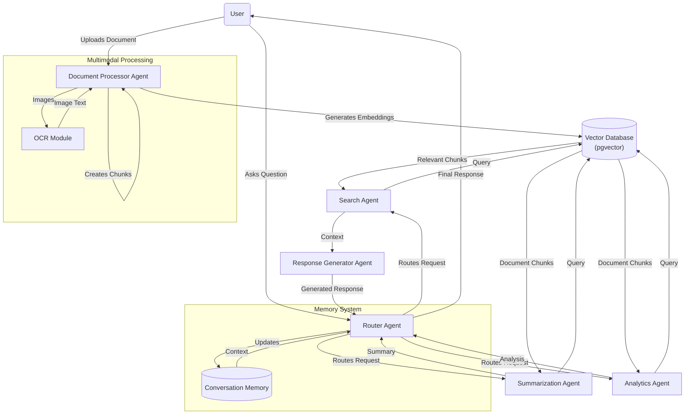

# DOCUMENT REPOSITORY (PDF Processing System Implementation Plan)

## Technology Stack

### Frontend
- **Framework**: Next.js 14 (App Router)
- **UI Components**: Shadcn UI
- **Styling**: Tailwind CSS
- **State Management**: React Context + Zustand
- **File Handling**: react-dropzone
- **Voice Input**: Web Speech API

### Backend
- **Runtime**: Next.js API Routes / Server Actions
- **Database**: Supabase (PostgreSQL + pgvector)
- **Storage**: Supabase Storage
- **Authentication**: *(To be implemented later)*

### AI & Processing
- **LLM Integration**: LangChain + LangGraph
- **Vector Embeddings**: OpenAI Embeddings API
- **Document Processing**: pdf.js, docx-parser, etc.
- **OCR**: Tesseract.js (client-side) or AWS Textract (server-side)
- **Speech Recognition**: Web Speech API (browser-native)

### Deployment
- **Hosting**: Vercel
- **CI/CD**: GitHub Actions
- **Monitoring**: Vercel Analytics

## Architecture Overview

The application will follow a hybrid architecture with server components, client components, and API routes. The main processing workflow will use LangChain and LangGraph to coordinate different agents.

### System Architecture Diagram

```
┌───────────────────────────┐     ┌────────────────────────┐
│  Next.js Frontend         │     │  Next.js API Routes    │
│                           │     │                        │
│  - Shadcn UI Components   │◄────┤  - LangChain Agents    │
│  - Tailwind CSS           │     │  - LangGraph Workflows │
│  - Client-side Processing │     │  - Document Processing │
└───────────┬───────────────┘     └──────────┬─────────────┘
            │                                 │
            │                                 │
            ▼                                 ▼
┌───────────────────────────────────────────────────────────┐
│                       Supabase                             │
│                                                           │
│  ┌─────────────┐    ┌──────────────┐    ┌──────────────┐  │
│  │ PostgreSQL  │    │ pgvector     │    │ Storage      │  │
│  │ (Metadata)  │    │ (Embeddings) │    │ (Documents)  │  │
│  └─────────────┘    └──────────────┘    └──────────────┘  │
│                                                           │
└───────────────────────────────────────────────────────────┘
```

### Multi-Agent Workflow Diagram



## Detailed Implementation Steps

### 1. Project Setup & Configuration

1. **Initialize Next.js Project**
   ```bash
   npx create-next-app@latest documents-search-repository --typescript --tailwind --eslint --app
   cd document-repository
   ```

2. **Setup Shadcn UI**
   ```bash
   npx shadcn@latest init
   ```
   - Configure with:
     - Typography: Yes
     - Default theme: Default
     - CSS variables: Yes
     - Global CSS: app/globals.css
     - Style: Default
     - Icons: Lucide React

3. **Install Required Dependencies**
   ```bash
   # Supabase
   npm install @supabase/supabase-js

   # State Management
   npm install zustand

   # File Handling
   npm install react-dropzone

   # Document Processing
   npm install pdfjs-dist mammoth xlsx

   # OCR
   npm install tesseract.js

   # LangChain & Vector DB
   npm install langchain @langchain/openai @langchain/community @langchain/core
   npm install @langchain/langgraph
   ```

4. **Set Up Environment Variables**
   ```
   # .env.local
   NEXT_PUBLIC_SUPABASE_URL=your_supabase_url
   NEXT_PUBLIC_SUPABASE_ANON_KEY=your_supabase_anon_key
   OPENAI_API_KEY=your_openai_api_key
   ```

### 2. Supabase Setup & Schema

1. **Create Supabase Project**
   - Create a new project in Supabase dashboard
   - Note the URL and anon key for environment variables

2. **Enable pgvector Extension**
   - Run in SQL Editor:
   ```sql
   CREATE EXTENSION IF NOT EXISTS vector;
   ```

3. **Create Database Tables**
   ```sql
   -- Documents table
   CREATE TABLE documents (
     id UUID PRIMARY KEY DEFAULT uuid_generate_v4(),
     title TEXT NOT NULL,
     description TEXT,
     file_path TEXT NOT NULL,
     file_type TEXT NOT NULL,
     file_size INTEGER NOT NULL,
     created_at TIMESTAMP WITH TIME ZONE DEFAULT NOW(),
     updated_at TIMESTAMP WITH TIME ZONE DEFAULT NOW(),
     metadata JSONB DEFAULT '{}'::JSONB
   );

   -- Chunks table
   CREATE TABLE chunks (
     id UUID PRIMARY KEY DEFAULT uuid_generate_v4(),
     document_id UUID REFERENCES documents(id) ON DELETE CASCADE,
     content TEXT NOT NULL,
     metadata JSONB DEFAULT '{}'::JSONB,
     embedding VECTOR(1536)
   );

   -- Create index for vector similarity search
   CREATE INDEX chunks_embedding_idx ON chunks 
   USING ivfflat (embedding vector_cosine_ops)
   WITH (lists = 100);

   -- Conversations table
   CREATE TABLE conversations (
     id UUID PRIMARY KEY DEFAULT uuid_generate_v4(),
     title TEXT NOT NULL,
     created_at TIMESTAMP WITH TIME ZONE DEFAULT NOW(),
     updated_at TIMESTAMP WITH TIME ZONE DEFAULT NOW()
   );

   -- Messages table
   CREATE TABLE messages (
     id UUID PRIMARY KEY DEFAULT uuid_generate_v4(),
     conversation_id UUID REFERENCES conversations(id) ON DELETE CASCADE,
     role TEXT NOT NULL CHECK (role IN ('user', 'assistant')),
     content TEXT NOT NULL,
     created_at TIMESTAMP WITH TIME ZONE DEFAULT NOW(),
     metadata JSONB DEFAULT '{}'::JSONB
   );

   -- Annotations table
   CREATE TABLE annotations (
     id UUID PRIMARY KEY DEFAULT uuid_generate_v4(),
     document_id UUID REFERENCES documents(id) ON DELETE CASCADE,
     chunk_id UUID REFERENCES chunks(id) ON DELETE SET NULL,
     content TEXT NOT NULL,
     created_at TIMESTAMP WITH TIME ZONE DEFAULT NOW()
   );
   ```

4. **Set Up Storage Buckets**
   - Create a `documents` bucket in Supabase Storage
   - Configure CORS policy for browser uploads
   - Set RLS policies for public access (no auth)

5. **Create Helper Functions**
   ```sql
   -- Function to search chunks by similarity
   CREATE OR REPLACE FUNCTION match_chunks(
     query_embedding VECTOR(1536),
     match_threshold FLOAT,
     match_count INT
   )
   RETURNS TABLE (
     id UUID,
     document_id UUID,
     content TEXT,
     metadata JSONB,
     similarity FLOAT
   )
   LANGUAGE plpgsql
   AS $$
   BEGIN
     RETURN QUERY
     SELECT
       chunks.id,
       chunks.document_id,
       chunks.content,
       chunks.metadata,
       1 - (chunks.embedding <=> query_embedding) AS similarity
     FROM chunks
     WHERE 1 - (chunks.embedding <=> query_embedding) > match_threshold
     ORDER BY chunks.embedding <=> query_embedding
     LIMIT match_count;
   END;
   $$;
   ```

### 3. Project Structure & Initial Implementation

1. **Folder Structure**
   ```
   /app
     /api
       /chat
       /documents
       /embeddings
       /summarize
     /components
       /ui                    # Shadcn components
       /document-viewer
       /chat-interface
       /document-processing
       /voice-input
     /lib
       /supabase              # Supabase client
       /agents                # LangChain agents
       /processors            # Document processors
       /utils                 # Utility functions
     /hooks                   # Custom React hooks
     /(routes)                # App pages
       /page.tsx              # Homepage
       /documents/page.tsx    # Document list
       /chat/page.tsx         # Chat interface
   /public                    # Static assets
   ```

2. **Set Up Supabase Client**
   ```typescript
   // app/lib/supabase/client.ts
   import { createClient } from '@supabase/supabase-js';

   const supabaseUrl = process.env.NEXT_PUBLIC_SUPABASE_URL!;
   const supabaseAnonKey = process.env.NEXT_PUBLIC_SUPABASE_ANON_KEY!;

   export const supabase = createClient(supabaseUrl, supabaseAnonKey);
   ```

3. **Create Document Processing Service**
   ```typescript
   // app/lib/processors/documentProcessor.ts
   import { supabase } from '../supabase/client';
   import { OpenAIEmbeddings } from '@langchain/openai';

   const embeddings = new OpenAIEmbeddings({
     openAIApiKey: process.env.OPENAI_API_KEY,
   });

   export async function processDocument(file: File, metadata: any) {
     // 1. Upload to Supabase storage
     const fileName = `${Date.now()}_${file.name}`;
     const { data: uploadData, error: uploadError } = await supabase.storage
       .from('documents')
       .upload(fileName, file);
     
     if (uploadError) throw uploadError;
     
     // 2. Create document record
     const { data: document, error: docError } = await supabase
       .from('documents')
       .insert({
         title: metadata.title || file.name,
         description: metadata.description || '',
         file_path: uploadData.path,
         file_type: file.type,
         file_size: file.size,
         metadata
       })
       .select()
       .single();
     
     if (docError) throw docError;
     
     // 3. Extract text, chunk, and create embeddings handled by background job
     // (In Vercel, this would be initiated but would need a separate solution for completion)
     
     return document;
   }
   ```

### 4. LangChain + LangGraph Setup

1. **Base Agent Configuration**
   ```typescript
   // app/lib/agents/baseAgent.ts
   import { ChatOpenAI } from '@langchain/openai';
   
   export const chatModel = new ChatOpenAI({
     openAIApiKey: process.env.OPENAI_API_KEY,
     modelName: 'gpt-4-turbo',
     temperature: 0,
   });
   ```

2. **Router Agent Implementation**
   ```typescript
   // app/lib/agents/routerAgent.ts
   import { StateGraph, createStateGraph } from '@langchain/langgraph';
   import { ChatPromptTemplate } from '@langchain/core/prompts';
   import { chatModel } from './baseAgent';
   
   const routerPrompt = ChatPromptTemplate.fromTemplate(`
     You are a router agent that determines how to handle a user request about documents.
     
     Based on the user query, determine the appropriate action:
     - SEARCH: If the user is asking about content in documents
     - SUMMARIZE: If the user wants a summary of a document
     - ANALYZE: If the user wants analytical insights about a document
     
     User Query: {query}
     
     Respond with just one word: SEARCH, SUMMARIZE, or ANALYZE.
   `);
   
   export const createRouterAgent = () => {
     // LangGraph implementation
     const graph = createStateGraph({
       channels: {
         input: {
           query: { type: 'string' },
         },
         output: {
           action: { type: 'string' },
         },
       },
     });
     
     // Define states and transitions
     // Implementation details...
     
     return graph;
   };
   ```

### 5. API Routes Implementation

1. **Document Upload Endpoint**
   ```typescript
   // app/api/documents/route.ts
   import { NextRequest, NextResponse } from 'next/server';
   import { processDocument } from '@/app/lib/processors/documentProcessor';

   export async function POST(request: NextRequest) {
     try {
       const formData = await request.formData();
       const file = formData.get('file') as File;
       const metadataStr = formData.get('metadata') as string;
       const metadata = JSON.parse(metadataStr || '{}');
       
       if (!file) {
         return NextResponse.json(
           { error: 'No file provided' },
           { status: 400 }
         );
       }
       
       const document = await processDocument(file, metadata);
       
       return NextResponse.json({ document });
     } catch (error) {
       console.error('Error uploading document:', error);
       return NextResponse.json(
         { error: 'Failed to upload document' },
         { status: 500 }
       );
     }
   }
   ```

2. **Chat Endpoint**
   ```typescript
   // app/api/chat/route.ts
   import { NextRequest, NextResponse } from 'next/server';
   import { supabase } from '@/app/lib/supabase/client';
   import { OpenAIEmbeddings } from '@langchain/openai';
   import { chatModel } from '@/app/lib/agents/baseAgent';
   import { ChatPromptTemplate } from '@langchain/core/prompts';
   
   const embeddings = new OpenAIEmbeddings({
     openAIApiKey: process.env.OPENAI_API_KEY,
   });
   
   export async function POST(request: NextRequest) {
     try {
       const { query, conversationId } = await request.json();
       
       // 1. Generate embeddings for the query
       const queryEmbedding = await embeddings.embedQuery(query);
       
       // 2. Search for relevant chunks
       const { data: chunks } = await supabase.rpc('match_chunks', {
         query_embedding: queryEmbedding,
         match_threshold: 0.7,
         match_count: 5
       });
       
       // 3. Prepare context from chunks
       const context = chunks.map(chunk => chunk.content).join('\n\n');
       
       // 4. Generate response with LLM
       const promptTemplate = ChatPromptTemplate.fromTemplate(`
         Answer the following question based on the provided context.
         If you don't know the answer, say "I don't know" - do not make up information.
         
         Context:
         {context}
         
         Question:
         {query}
         
         Answer:
       `);
       
       const chain = promptTemplate.pipe(chatModel);
       const response = await chain.invoke({
         context,
         query
       });
       
       // 5. Save message to conversation
       if (conversationId) {
         await supabase.from('messages').insert([
           { conversation_id: conversationId, role: 'user', content: query },
           { conversation_id: conversationId, role: 'assistant', content: response.content }
         ]);
       }
       
       return NextResponse.json({ 
         answer: response.content,
         sources: chunks.map(chunk => ({
           documentId: chunk.document_id,
           similarity: chunk.similarity
         }))
       });
     } catch (error) {
       console.error('Error in chat API:', error);
       return NextResponse.json(
         { error: 'Failed to process chat request' },
         { status: 500 }
       );
     }
   }
   ```

### 6. Frontend Components

1. **Document Upload Component**
   ```typescript
   // app/components/document-processing/DocumentUpload.tsx
   // Implementation details
   ```

2. **Chat Interface Component**
   ```typescript
   // app/components/chat-interface/ChatInterface.tsx
   // Implementation details
   ```

3. **Voice Input Component**
   ```typescript
   // app/components/voice-input/VoiceInput.tsx
   // Implementation details
   ```

## Development Roadmap

### Phase 1: MVP (4 weeks)
- Basic document upload and processing
- Simple chat interface
- Core search and answer generation
- Deployment to Vercel

### Phase 2: Enhanced Features (4 weeks)
- Improved document viewer
- Multi-document search
- Conversation memory
- Summarization features
- Advanced UI components
- Voice input implementation

### Phase 3: Advanced Features (4 weeks)
- Analytics features
- Ethical AI enhancements
- Performance optimizations
- Extended document support
- Advanced search capabilities
- Enhanced voice interaction

### Phase 4: Refinement and Future Features (2-3 weeks)
- User testing and feedback
- Bug fixes and optimizations
- Documentation
- Authentication system implementation
- Final deployment

## Technical Challenges & Considerations

1. **Vercel Serverless Function Limits**
   - 10-second execution timeout on hobby plan
   - 50MB deployment size limit
   - Solution: Optimize processing, use streaming, consider background jobs

2. **Supabase pgvector Performance**
   - Optimize index creation for vector similarity search
   - Use appropriate distance metrics (cosine, euclidean, etc.)
   - Consider chunking strategy impact on vector storage

3. **Large Document Handling**
   - Implement progressive processing for large files
   - Consider client-side chunking before upload
   - Use web workers for browser-based processing

4. **LangChain Integration with Next.js**
   - Keep heavy processing in API routes
   - Use server components for data fetching
   - Implement proper error handling for LLM requests

5. **Managing LLM Costs**
   - Implement token counting and budgeting
   - Cache responses where appropriate
   - Use tiered models based on task complexity

6. **Voice Recognition Challenges**
   - Browser compatibility for Web Speech API
   - Handling background noise and accents
   - Fallback mechanisms for unreliable recognition
   - Handling microphone permissions across devices

7. **No Authentication Considerations**
   - Implement appropriate session tracking without user accounts
   - Consider using browser storage for conversation history
   - Ensure clear data retention policies for anonymous usage

## Monitoring & Analytics

1. **Application Monitoring**
   - Implement Vercel Analytics
   - Set up error tracking
   - Monitor API usage

2. **User Analytics**
   - Track document uploads and processing
   - Monitor query patterns
   - Analyze user engagement
   - Track voice input usage and accuracy

3. **Performance Metrics**
   - Response times
   - Processing durations
   - Resource utilization
   - Voice recognition accuracy rates

## Security Considerations

1. **Data Privacy**
   - Implement secure document handling even without authentication
   - Consider temporary storage for uploaded documents
   - Clear retention policies for user data
   - Process voice data locally when possible

2. **API Security**
   - Rate limiting
   - Input validation
   - Implement basic request validation mechanisms

3. **Voice Input Security**
   - Clear privacy policies for voice data handling
   - Local processing preference over cloud transmission
   - Temporary voice data storage

## Conclusion

This implementation plan provides a comprehensive approach to building the PDF Processing System using Next.js, Shadcn UI, Tailwind, and Supabase. The multi-agent architecture powered by LangChain and LangGraph will enable advanced document processing capabilities while working within the constraints of Vercel deployment. The addition of voice input capabilities enhances accessibility and provides a more natural interaction model for users.

The phased development approach allows for incremental delivery of features while ensuring that core functionality is prioritized. Authentication will be implemented in a later phase, allowing initial focus on the core document processing and AI capabilities. Regular testing and optimization will be essential to maintain performance and user experience. 